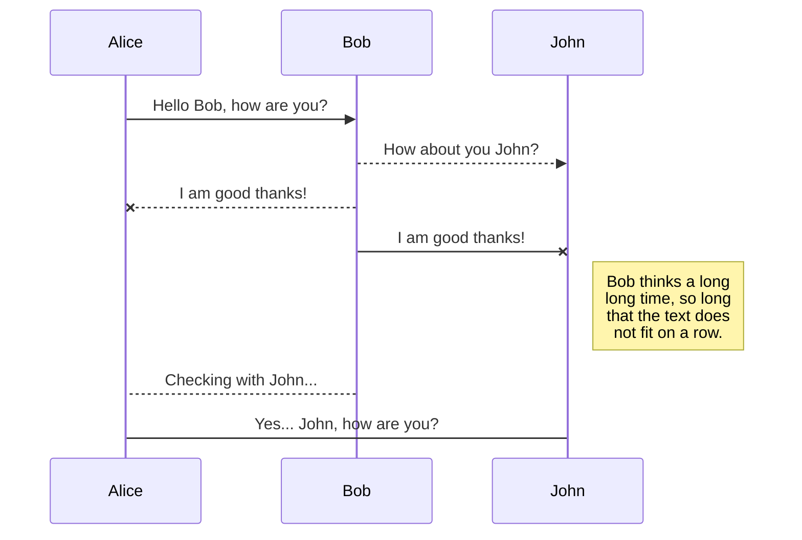
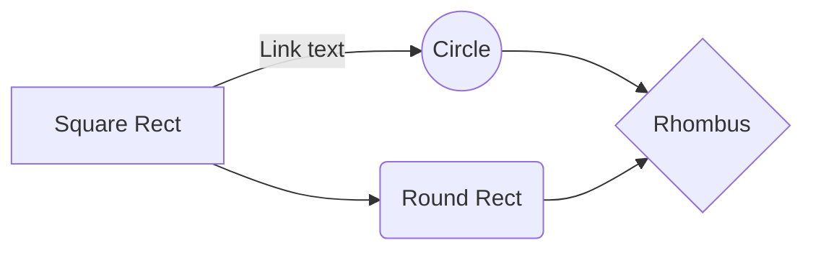

## Breve descripción
Esta librería es un SDK que tiene como objetivo facilitar el uso de las APIs de [ENZONA](https://www.enzona.net/), de manera tal que el desarrollador solo tenga que concentrarse en la lógica de negocio de su proyecto.

## APIs disponibles

| API | Dispnible |
| ------ | ------ |
| PaymentAPI | :white_check_mark: |
| QRAPI | :ballot_box_with_check: |
| ClaimAPI | :ballot_box_with_check: |
| XMET_AccountAPI | :ballot_box_with_check: |
| XMET_AccountingOperationAPI | :ballot_box_with_check: |

## Primeros pasos
Antes de comenzar a usar este SDK es recomendado que primero revise la documentación oficial proporcionada por el equipo de ENZONA para que conozca el ambiente de pruebas **(bulevar/api sandbox)** y tenga el conocimiento base del funcionamiento de las APIs.

 1. [Primero vea este simple tutorial](https://github.com/MoonMagiCreation/enzona_api#:~:text=http%3A//enzonatuto.intellifoundry.com/%3Ffbclid%3DIwAR2_-5-en2liC64HRyNNkc7DxJ1jpZimnlXciZC6vbgv_Ghe8Va5fBVApsk
)
 2. [Acceso a la documentación y ejemplos oficiales desde el api sandbox](https://apisandbox.enzona.net/store/apis/info?name=PaymentAPI&version=v1.0.0&provider=admin#tab2)
 

## Para usar este SDK
Lo primero es añadir **enzona** como una dependencia más de tu proyecto, para esto puedes usar el comando:

**Para proyectos puramente en Dart**
```shell
dart pub add enzona
```
**Para proyectos en Flutter**
```shell
flutter pub add enzona
```
Este comando añadirá **enzona** al **pubspec.yaml** de tu proyecto.
Finalmente solo tienes que ejecutar:

`dart pub get` **ó** `flutter pub get` según el tipo de proyecto para descargar la dependencia a tu pub-cache

## ¿Cómo usar este SDK?
### Muy simple, solo construyes una instancia de este SDK de Enzona así:
```dart
final enzona = Enzona(  
  apiUrl: apiUrl, //Url base de las APIs de ENZONA (https://api.enzona.net ó https://apisandbox.enzona.net)
  accessTokenUrl: accessTokenUrl, //Opcionalmente. Url del endpoint de autenticación OAuth2 (https://api.enzona.net/token ó https://apisandbox.enzona.net/token), esta Url en caso de no pasarse se asume automáticamente la Url: '$apiUrl/token'
  consumerKey: consumerKey, //El Consumer Key del Comercio para el cual se desea acceder a las APIs de ENZONA
  consumerSecret: consumerSecret, //El Consumer Secret del Comercio para el cual se desea acceder a las APIs de ENZONA
  scopes: scopes, //El alcance que tendrá el token de autenticacón
  timeout: Duration(seconds: 30), //Opcionalmente el tiempo de espera antes de abortar una petición al API
  httpClient: HttpClient(), //Opcionalmente una instancia de HttpClient para tener control sobre las peticiones http, como la validación de certificados, etc.
);
```
**Y luego la inicializas así:**
```dart
await enzona.init();
```
**Y listo ya tienes acceso a las APIs de ENZONA...**
> En la mayoría de los casos con una instancia simple como esta bastará:
> ```dart
>final enzona = Enzona(  
>  apiUrl: apiUrl,  
>  consumerKey: consumerKey,  
>  consumerSecret: consumerSecret,  
>  scopes: scopes,  
>);
>```

## ¿Cómo funciona la autenticación?
Las APIs de ENZONA implementan una variante de OAuth2 **(sin renovación de token)** para la autenticación, [*(ver documentación)*](https://apisandbox.enzona.net/store/site/themes/wso2/templates/api/documentation/download.jag?tenant=carbon.super&resourceUrl=/registry/resource/_system/governance/apimgt/applicationdata/provider/admin/PaymentAPI/v1.0.0/documentation/files/C%D1%83mo%20Obtener%20el%20token%20de%20acceso%20en%20las%20%20APIs.docx). Este SDK  implementa autenticación OAuth2 y además se encarga de **renovar el token automáticamente** sin que el desarrollador se tenga que preocupar por eso, en cada petición a las APIs se comprueba la validez del token y si este ha expirado, se procede a re-autenticar, y se continua con la petición original.
De igual forma es posible renovar el token manualmente así como obtener las credenciales de autenticación.
```dart
final credentials = await enzona.refreshCredentials();  
print(credentials.accessToken);
```

## ¿Cómo usar el PaymentAPI?
Desde una instancia del sdk puedes acceder a las APIs disponibles, entre estas el API de pagos. Ten en cuenta que el **scope** *(alcance)* que hayas usado para la autenticación es lo que determina a qué APIs podrás acceder con el **token** generado.

### Funciones disponibles PaymentAPI

| Función | Soportada |
| ------ | ------ |
| Listar/filtrar pagos | :white_check_mark: |
| Obtener detalles de un pago | :white_check_mark: |
| Crear un pago | :white_check_mark: |
| Completar un pago | :white_check_mark: |
| Cancelar un pago | :white_check_mark: |
| Listar/filtrar devoluciones | :white_check_mark: |
| Obtener detalles de una devolución | :white_check_mark: |
| Realizar una devolución parcial o completa | :white_check_mark: |


### Listar/filtrar pagos
```dart
final response = await enzona.paymentAPI.getPayments(pageIndex: 0, pageSize: 5);  
if(response.isSuccessful && (response.body?.isNotEmpty ?? false)) {  
  print('totalCount: ${response.headers[Pagination.totalCountHeader]}');  
 for(var payment in response.body!) {  
    print('id: ${payment.transactionUUID}, statusCode: ${payment.statusCode}');  
  }  
}
```
> **Pagination.totalCountHeader** se refiere al valor total de pagos que llega en los headers del response.

## Create files and folders

The file explorer is accessible using the button in left corner of the navigation bar. You can create a new file by clicking the **New file** button in the file explorer. You can also create folders by clicking the **New folder** button.

## Switch to another file

All your files and folders are presented as a tree in the file explorer. You can switch from one to another by clicking a file in the tree.

## Rename a file

You can rename the current file by clicking the file name in the navigation bar or by clicking the **Rename** button in the file explorer.

## Delete a file

You can delete the current file by clicking the **Remove** button in the file explorer. The file will be moved into the **Trash** folder and automatically deleted after 7 days of inactivity.

## Export a file

You can export the current file by clicking **Export to disk** in the menu. You can choose to export the file as plain Markdown, as HTML using a Handlebars template or as a PDF.


# Synchronization

Synchronization is one of the biggest features of StackEdit. It enables you to synchronize any file in your workspace with other files stored in your **Google Drive**, your **Dropbox** and your **GitHub** accounts. This allows you to keep writing on other devices, collaborate with people you share the file with, integrate easily into your workflow... The synchronization mechanism takes place every minute in the background, downloading, merging, and uploading file modifications.

There are two types of synchronization and they can complement each other:

- The workspace synchronization will sync all your files, folders and settings automatically. This will allow you to fetch your workspace on any other device.
	> To start syncing your workspace, just sign in with Google in the menu.

- The file synchronization will keep one file of the workspace synced with one or multiple files in **Google Drive**, **Dropbox** or **GitHub**.
	> Before starting to sync files, you must link an account in the **Synchronize** sub-menu.

## Open a file

You can open a file from **Google Drive**, **Dropbox** or **GitHub** by opening the **Synchronize** sub-menu and clicking **Open from**. Once opened in the workspace, any modification in the file will be automatically synced.

## Save a file

You can save any file of the workspace to **Google Drive**, **Dropbox** or **GitHub** by opening the **Synchronize** sub-menu and clicking **Save on**. Even if a file in the workspace is already synced, you can save it to another location. StackEdit can sync one file with multiple locations and accounts.

## Synchronize a file

Once your file is linked to a synchronized location, StackEdit will periodically synchronize it by downloading/uploading any modification. A merge will be performed if necessary and conflicts will be resolved.

If you just have modified your file and you want to force syncing, click the **Synchronize now** button in the navigation bar.

> **Note:** The **Synchronize now** button is disabled if you have no file to synchronize.

## Manage file synchronization

Since one file can be synced with multiple locations, you can list and manage synchronized locations by clicking **File synchronization** in the **Synchronize** sub-menu. This allows you to list and remove synchronized locations that are linked to your file.


# Publication

Publishing in StackEdit makes it simple for you to publish online your files. Once you're happy with a file, you can publish it to different hosting platforms like **Blogger**, **Dropbox**, **Gist**, **GitHub**, **Google Drive**, **WordPress** and **Zendesk**. With [Handlebars templates](http://handlebarsjs.com/), you have full control over what you export.

> Before starting to publish, you must link an account in the **Publish** sub-menu.

## Publish a File

You can publish your file by opening the **Publish** sub-menu and by clicking **Publish to**. For some locations, you can choose between the following formats:

- Markdown: publish the Markdown text on a website that can interpret it (**GitHub** for instance),
- HTML: publish the file converted to HTML via a Handlebars template (on a blog for example).

## Update a publication

After publishing, StackEdit keeps your file linked to that publication which makes it easy for you to re-publish it. Once you have modified your file and you want to update your publication, click on the **Publish now** button in the navigation bar.

> **Note:** The **Publish now** button is disabled if your file has not been published yet.

## Manage file publication

Since one file can be published to multiple locations, you can list and manage publish locations by clicking **File publication** in the **Publish** sub-menu. This allows you to list and remove publication locations that are linked to your file.


# Markdown extensions

StackEdit extends the standard Markdown syntax by adding extra **Markdown extensions**, providing you with some nice features.

> **ProTip:** You can disable any **Markdown extension** in the **File properties** dialog.


## SmartyPants

SmartyPants converts ASCII punctuation characters into "smart" typographic punctuation HTML entities. For example:

|                |ASCII                          |HTML                         |
|----------------|-------------------------------|-----------------------------|
|Single backticks|`'Isn't this fun?'`            |'Isn't this fun?'            |
|Quotes          |`"Isn't this fun?"`            |"Isn't this fun?"            |
|Dashes          |`-- is en-dash, --- is em-dash`|-- is en-dash, --- is em-dash|


## KaTeX

You can render LaTeX mathematical expressions using [KaTeX](https://khan.github.io/KaTeX/):

The *Gamma function* satisfying $\Gamma(n) = (n-1)!\quad\forall n\in\mathbb N$ is via the Euler integral

$$
\Gamma(z) = \int_0^\infty t^{z-1}e^{-t}dt\,.
$$

> You can find more information about **LaTeX** mathematical expressions [here](http://meta.math.stackexchange.com/questions/5020/mathjax-basic-tutorial-and-quick-reference).


## UML diagrams

You can render UML diagrams using [Mermaid](https://mermaidjs.github.io/). For example, this will produce a sequence diagram:



And this will produce a flow chart:

